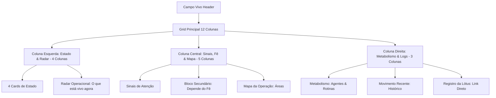

# PULSO v1.0: Visual Blueprint do Campo Vivo

Este documento estabelece o design, estrutura de dados e especificações comportamentais da página **Campo Vivo (`/pulso/cockpit`)** como a referência visual canônica do ecossistema PULSO v1.0. 

A interface do Campo Vivo foi desenhada sob o princípio de um **cockpit operacional dinâmico**, rejeitando formatos lineares de lista para a visualização principal e priorizando o monitoramento espacial do ecossistema.

---

## 1. Regra de Ouro (Core Principle)

> [!IMPORTANT]
> **VETO DE CONVERSÃO EM LISTA LINEAR**
> É expressamente proibido converter o Campo Vivo (`/pulso/cockpit`) em uma lista linear única de tarefas ou dashboard plano. A página deve sempre preservar a composição espacial de 3 colunas, a visualização radial do radar e os blocos de monitoramento operacional descritos neste documento.

---

## 2. Estrutura do Layout em 3 Colunas

A distribuição espacial do Campo Vivo segue uma malha com grid de 12 colunas no desktop, dividida em três pilares funcionais:

### Coluna 1 (Esquerda - `lg:col-span-4`): Estado & Radar
1. **Cards de Estado Superiores:** Grid de quatro indicadores com ícones e valores numéricos brutos:
   * **Ações da Lótus** (Âmbar): Contagem de itens pendentes no registro de inbox esperando governança do Fê.
   * **Projetos Vivos** (Azul): Quantidade de projetos em andamento no ecossistema (ignora arquivados).
   * **Depende do Fe** (Esmeralda): Total de tarefas ativas designadas explicitamente para o Felipe.
   * **Riscos & Travas** (Vermelho): Contagem de alertas ativos que necessitam de intervenção.
2. **Radar Operacional ("O que está vivo agora"):** Painel circular dinâmico que plota graficamente:
   * *Alertas Ativos* (Vermelho) no anel mais externo (Estratégico/Externo).
   * *Projetos em Andamento* (Azul) na zona intermediária.
   * *Áreas Críticas* (Esmeralda) na zona central.

### Coluna 2 (Central - `lg:col-span-5`): Sinais, Ações do Fê & Mapa
1. **Sinais de Atenção (Vermelho/Âmbar):** Lista consolidada de riscos graves. Agrupa alertas de sistema não resolvidos (críticos) e rotinas automatizadas que falharam em seu último batimento.
2. **Depende do Fê (Âmbar - Secundário):** Bloco contendo até 5 tarefas prioritárias que estão ativas e pendentes de execução ou decisão pelo Felipe. Possui rolagem interna e indica a prioridade do item.
3. **Mapa da Operação:** Mapeamento visual das áreas organizativas vigentes. Lista cada área e calcula em tempo real o número de projetos vinculados e alertas ativos nela.

### Coluna 3 (Direita - `lg:col-span-3`): Metabolismo & Logs
1. **Metabolismo (Esmeralda):** Painel do estado vital do ecossistema. Exibe o número de agentes de software ativos e o volume total de rotinas registradas, indicando se o pulso sistêmico está estável.
2. **Movimento Recente (Azul/Cinza):** Exibição cronológica das últimas 5 ações auditáveis gravadas nos logs do sistema (login do usuário, disparos de agentes, atualizações críticas).
3. **Registro da Lótus (Link Rápido):** Bloco com gradiente de ação que direciona o usuário imediatamente para a central `/pulso/inbox`.

---

## 3. Diretrizes de Confiabilidade de Código (Defensive Architecture)

Para evitar os crashs em produção causados por incompatibilidade ou ausência de dados legados no Firestore, a CockpitPage implementa:

1. **Granular SafeBlocks (Error Boundaries):**
   Cada um dos widgets do cockpit é encapsulado por um componente React de captura de exceção local. Se a renderização interna de um bloco falhar devido a uma propriedade ausente, apenas aquele bloco cai em fallback, exibindo uma mensagem amigável, enquanto o resto da página continua ativo e utilizável.
2. **Checagem Rígida de Arrays:**
   É obrigatório utilizar a função utilitária `safeArray(data)` antes de aplicar qualquer método de iteração, filtragem ou ordenação (`map`, `filter`, `slice`, `reduce`).
3. **Optional Chaining Universal:**
   Toda leitura de propriedades de objetos recuperados do Firestore deve obrigatoriamente fazer uso de `?.` (ex: `t?.title`, `area?.importance`).
4. **Isolamento de Erros em Serviços:**
   No `pulsoService`, todas as requisições assíncronas assíncronas paralelas via `Promise.all` possuem um encadeamento de `.catch()` individual que injeta um array vazio em caso de falha. Isso garante que a perda temporária de uma coleção não quebre a leitura das demais coleções.
