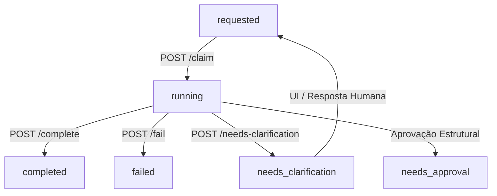

# Requests Bridge Operational Kit: Especificação e Contratos

Este kit define as especificações, rotas, autenticação e os esquemas canônicos da camada **Requests Bridge**. Ele serve como guia operacional e contrato de integração para que a Lótus/OpenClaw crie, consuma, processe e verifique o ciclo de vida completo de solicitações operacionais no PULSO de forma autônoma e segura.

---

## A. Base URL Real da Bridge
Todas as requisições para a Requests Bridge devem ser direcionadas para a Cloud Function canônica de produção:

*   **URL Direta da Cloud Function**: `https://us-central1-felipedutraapps.cloudfunctions.net/pulsoRequests`
*   **URL via Rewrite (PULSO API)**: `https://felipedutraapps.web.app/api/pulso/requests`

---

## B. Autenticação
O acesso à Requests Bridge é estritamente autenticado via token de autorização no cabeçalho HTTP. 

*   **Formato do Header**: `Authorization: Bearer <TOKEN>`
*   **Variável de Ambiente Esperada**: O token está armazenado no Secret Manager da infraestrutura como `PULSO_INGEST_TOKEN`.
*   **Exemplo de Envio**:
    ```http
    Authorization: Bearer $PULSO_INGEST_TOKEN
    ```

---

## C. Endpoints Reais Disponíveis

### 1. Criar Solicitação (`POST /create`)
Registra uma nova intenção operacional na fila do Cockpit.

*   **Método**: `POST`
*   **Path**: `/create` (ou `/requests/create`)
*   **Headers**: `Authorization: Bearer $PULSO_INGEST_TOKEN`, `Content-Type: application/json`
*   **Body Esperado**:
    ```json
    {
      "requestType": "register_person",
      "title": "Registrar Rodrigo (WhatsApp)",
      "summary": "Cadastro solicitado a partir de comando externo.",
      "priority": "medium",
      "areaRef": "area_openclaw",
      "requestedBy": "agent_lotus",
      "dedupeKey": "msg_whats_12345",
      "origin": {
        "channel": "whatsapp",
        "source": "openclaw",
        "messageRef": "msg_abc_123"
      },
      "payload": {
        "name": "Rodrigo",
        "role": "Sócio Gestor",
        "notes": "Parceiro e contato de gestão."
      }
    }
    ```
*   **Respostas Esperadas**:
    *   `201 Created`: `{"status": "created", "requestId": "req_1778543657928_61unwi"}`
    *   `200 OK (Duplicado)`: `{"status": "duplicate", "requestId": "req_1778543657928_61unwi"}` (quando um request ativo com a mesma `dedupeKey` já existe).
*   **Erros Possíveis**: `400 Bad Request` (requestType inválido), `401 Unauthorized` (token incorreto).

### 2. Listar Solicitações Pendentes (`GET /pending`)
Retorna solicitações com status `requested` prontas para consumo por agentes.

*   **Método**: `GET`
*   **Path**: `/pending` (ou `/`)
*   **Query Params Opcionais**: `limit` (padrão: 20), `requestType`, `status` (padrão: requested).
*   **Resposta Esperada** (`200 OK`):
    ```json
    [
      {
        "id": "req_1778543657928_61unwi",
        "requestType": "register_person",
        "title": "Registrar Rodrigo (WhatsApp)",
        "status": "requested",
        "priority": "medium",
        "requestedBy": "agent_lotus",
        "dedupeKey": "msg_whats_12345",
        "payload": { "name": "Rodrigo", "role": "Sócio Gestor" },
        "requestedAt": "2026-05-11T23:54:17.969Z"
      }
    ]
    ```

### 3. Reivindicar Processamento (`POST /claim`)
Aplica um lock atômico na solicitação, mudando o status para `running` para evitar duplo processamento.

*   **Método**: `POST`
*   **Path**: `/claim`
*   **Body Esperado**:
    ```json
    {
      "requestId": "req_1778543657928_61unwi",
      "processedBy": "openclaw_agent_lotus"
    }
    ```
*   **Respostas Esperadas**:
    *   `200 OK`: `claimed`
*   **Erros Possíveis**: `404 Not Found`, `409 Conflict` (request já não está no status requested).

### 4. Concluir e Materializar (`POST /complete`)
Marca o processo como concluído e aciona o **Dispatcher de Materialização** interno para criar/atualizar a entidade na base canônica correspondente.

*   **Método**: `POST`
*   **Path**: `/complete`
*   **Body Esperado**:
    ```json
    {
      "requestId": "req_1778543657928_61unwi",
      "result": { "executionStatus": "success", "notes": "Processado com sucesso." }
    }
    ```
*   **Resposta Esperada** (`200 OK`): `completed` (ou `needs_approval` se a entidade for restrita, ou `needs_clarification` se a materialização falhar por campos ausentes).

### 5. Informar Falha (`POST /fail`)
Registra que a execução da solicitação encontrou um erro irrecuperável ou falhou tecnicamente.

*   **Método**: `POST`
*   **Path**: `/fail`
*   **Body Esperado**:
    ```json
    {
      "requestId": "req_1778543657928_61unwi",
      "error": "Conexão com API externa indisponível",
      "recoverable": true,
      "nextSuggestedAction": "retry_in_5m"
    }
    ```
*   **Resposta Esperada** (`200 OK`): `failed`

### 6. Solicitar Esclarecimento (`POST /needs-clarification`)
Pausa a solicitação indicando que o agente autônomo precisa de dados adicionais ou aprovação de um humano para prosseguir.

*   **Método**: `POST`
*   **Path**: `/needs-clarification`
*   **Body Esperado**:
    ```json
    {
      "requestId": "req_1778543657928_61unwi",
      "question": "Qual o nível de severidade e o projeto de destino exato para este alerta?",
      "missingFields": ["severity", "projectRef"]
    }
    ```
*   **Resposta Esperada** (`200 OK`): `needs_clarification`

### 7. Consultar Solicitação por ID (`GET /:id`)
Busca o documento de uma solicitação específica e seu objeto completo de resultado (incluindo caminhos materializados).

*   **Método**: `GET`
*   **Path**: `/req_1778543657928_61unwi` (ou `/requests/req_1778543657928_61unwi`)
*   **Resposta Esperada** (`200 OK`):
    ```json
    {
      "id": "req_1778543657928_61unwi",
      "requestType": "register_person",
      "status": "completed",
      "title": "Registrar Rodrigo (WhatsApp)",
      "result": {
        "executionStatus": "success",
        "entityRef": "person_rodrigo",
        "entityPath": "workspaces/felipe_dutra/pulso_people/person_rodrigo",
        "matResult": {
          "ok": true,
          "action": "created",
          "entityType": "person",
          "entityRef": "person_rodrigo",
          "entityPath": "workspaces/felipe_dutra/pulso_people/person_rodrigo",
          "summary": "Entidade materializada."
        }
      },
      "updatedAt": "2026-05-12T00:07:22.000Z"
    }
    ```

---

## D. Status Lifecycle
O ciclo de vida canônico de uma solicitação atravessa as seguintes fases no Firestore:



---

## E. Shape Real do Request (Exemplos de Intenção)

### 1. `register_person`
```json
{
  "requestType": "register_person",
  "title": "Cadastro de Parceiro: Murilo Gun",
  "summary": "Novo contato de ecossistema.",
  "priority": "high",
  "requestedBy": "agent_lotus",
  "payload": {
    "name": "Murilo Gun",
    "role": "Fundador da Despertar",
    "relationType": "partner",
    "attentionLevel": "high"
  }
}
```

### 2. `register_source`
```json
{
  "requestType": "register_source",
  "title": "Fonte de Custos da Obra",
  "summary": "Planilha financeira de São Lourenço.",
  "priority": "high",
  "requestedBy": "agent_lotus",
  "payload": {
    "name": "Planilha Custos Obra 2026",
    "type": "google_sheets",
    "url": "https://docs.google.com/spreadsheets/d/xxx",
    "relevance": "high"
  }
}
```

### 3. `create_task`
```json
{
  "requestType": "create_task",
  "title": "Validar Contrato OpenClaw",
  "priority": "critical",
  "requestedBy": "agent_lotus",
  "payload": {
    "title": "Validar Contrato OpenClaw",
    "description": "Auditar se todos os eventos seguem o schema de idempotência."
  }
}
```

### 4. `create_agent`
```json
{
  "requestType": "create_agent",
  "title": "Novo Agente de Curadoria Musical",
  "summary": "Proposta de agente autônomo para OCRE.",
  "priority": "medium",
  "requestedBy": "agent_lotus",
  "payload": {
    "role": "Music Curator",
    "systemsUsed": ["spotify", "youtube", "obsidian"]
  }
}
```

---

## F. Shape Real do Result
Após o processamento e a conclusão, o campo `result` canônico armazenado no request contém a auditoria do **Dispatcher de Materialização**:

```json
{
  "entityRef": "person_murilo_gun",
  "entityPath": "workspaces/felipe_dutra/pulso_people/person_murilo_gun",
  "matResult": {
    "ok": true,
    "action": "created",
    "entityType": "person",
    "entityRef": "person_murilo_gun",
    "entityPath": "workspaces/felipe_dutra/pulso_people/person_murilo_gun",
    "summary": "Entidade materializada."
  }
}
```
*Se a materialização falhar ou exigir esclarecimento:*
```json
{
  "question": "Nome é obrigatório para registrar pessoa.",
  "missingFields": ["name"]
}
```

---

## G. Firestore Paths Canônicos
Os caminhos oficiais de armazenamento de coleções no Firestore sob a raiz `workspaces/felipe_dutra/` são:

*   **Intenções Operacionais**: `workspaces/felipe_dutra/pulso_requests`
*   **Pessoas**: `workspaces/felipe_dutra/pulso_people`
*   **Fontes**: `workspaces/felipe_dutra/pulso_sources`
*   **Tarefas**: `workspaces/felipe_dutra/pulso_tasks`
*   **Decisões**: `workspaces/felipe_dutra/pulso_decisions`
*   **Alertas**: `workspaces/felipe_dutra/pulso_alerts`
*   **Projetos**: `workspaces/felipe_dutra/pulso_projects`
*   **Áreas**: `workspaces/felipe_dutra/pulso_areas`
*   **Agentes**: `workspaces/felipe_dutra/pulso_agents`

---

## H. Como Provar a Materialização (Guia de Validação Externa)
Para provar conclusivamente que o ciclo operacional funcionou além do escopo da Bridge, o agente autônomo deve:

1.  **Capturar a Chave de Destino**: Ao receber o status `completed` no `POST /complete` ou consultar `GET /:id`, extrair a propriedade `result.entityRef` ou `result.entityPath`.
2.  **Ler a Coleção Canônica**: Utilizar o SDK/API do Firestore ou a REST API para buscar o documento gerado na respectiva coleção:
    *   Para `register_person`, buscar o ID em `pulso_people`. Confirmar se `name`, `role` e `importance` foram espelhados a partir do payload.
    *   Para `register_source`, buscar o ID em `pulso_sources`.
    *   Para `create_task`, buscar o ID em `pulso_tasks`.
    *   Para `create_agent`, verificar se o status gravado no request reflete `needs_approval` garantindo a barreira de segurança sistêmica.
