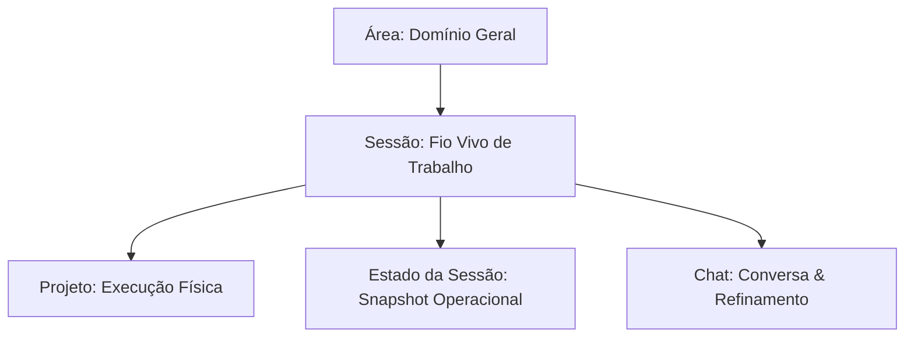

# Arquitetura de Sessões e Estado da PULSO

Este documento detalha o modelo conceitual e o schema de dados proposto para a organização e persistência de sessões no ecossistema PULSO.

---

## Premissa Fundamental

> **Conversa não é banco de dados.**
> **Conversa é fluxo.**
> **A PULSO guarda o estado vivo.**
> **A memória guarda o que é durável.**

O chat não deve ser tratado como a fonte única da verdade ou o repositório estruturado de dados. A conversa é apenas o canal de refinamento, alinhamento e interação operacional. O estado operacional consolidado vive nas **Sessões** e na **Memória de Longo Prazo** da Lótus/PULSO.

---

## Modelo Conceitual



### 1. Área
* **Definição:** Um grande domínio ou divisão de foco do ecossistema ÉDEN (ex: Campo Vivo, Saúde, Metabolismo/Agentes).
* **Propósito:** Agrupar conhecimentos, regras e fluxos de alta hierarquia.

### 2. Sessão
* **Definição:** O "fio vivo" de trabalho. É um fluxo temporário e ativo aberto com um objetivo operacional explícito.
* **Propósito:** Manter o foco da Lótus ativo em um determinado assunto, evitando que discussões paralelas misturem contextos.

### 3. Projeto
* **Definição:** A concretização física da execução na ponta (ex: construção do app desktop, plantio de uma área, etc.).
* **Propósito:** Representar entregáveis com marcos de sucesso claros.

### 4. Estado da Sessão (Snapshot)
* **Definição:** Um snapshot estruturado contendo o progresso atual, pendências críticas (open loops) e decisões.
* **Propósito:** Permitir que qualquer agente ou a própria Lótus retome o trabalho instantaneamente sem ter que reler centenas de mensagens de chat.

### 5. Chat
* **Definição:** A trilha de mensagens geradas durante o refinamento e refinanciamento do estado.
* **Propósito:** Servir como histórico cronológico e interface conversacional.

---

## Proposta de Schema de Dados (Firestore / Relacional)

### 1. Área (`Area`)
Representa os grandes macro-domínios do ecossistema.
```typescript
interface Area {
  id: string;      // Identificador único (UUID ou Slug)
  name: string;    // Nome da área (ex: "Metabolismo")
  slug: string;    // Slug para rotas/APIs (ex: "metabolismo")
}
```

### 2. Sessão (`Session`)
Representa o fio ativo atual, contexto operacional consolidado e pendências abertas.
```typescript
interface Session {
  id: string;
  areaRef: string;        // ID da Área associada
  title: string;          // Título descritivo do objetivo da sessão
  status: 'active' | 'archived' | 'completed';
  currentContext: string; // Resumo textual do contexto operacional consolidado
  openLoops: string[];    // Lista de pendências/loops operacionais abertos
  nextSteps: string[];    // Próximos passos imediatos acordados
  decisions: string[];    // Decisões cruciais consolidadas
  peopleRefs: string[];   // Lista de IDs de pessoas envolvidas (ex: Felipe)
  sourceRefs: string[];   // Referência a documentos, caminhos de arquivo ou links
  updatedAt: string;      // Timestamp ISO da última alteração de estado
}
```

### 3. Mensagem (`Message`)
Histórico de mensagens de chat atreladas a uma sessão ativa.
```typescript
interface Message {
  id: string;
  sessionRef: string;     // ID da Sessão associada
  areaRef: string;        // ID da Área associada
  input: string;          // Mensagem enviada pelo usuário (Felipe)
  response: string;       // Resposta devolvida pelo assistente/Lótus
  role: 'user' | 'assistant' | 'system';
  createdAt: string;      // Timestamp ISO de criação
}
```
