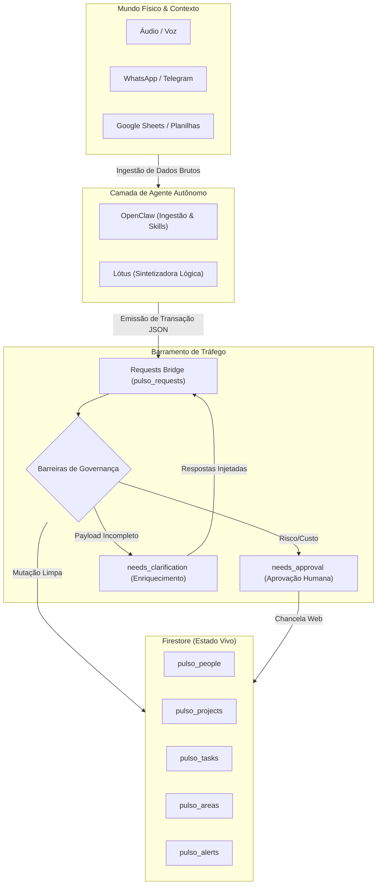

# Blueprint Operacional e Metodologia de Replicação: PULSO v1.0

Este documento descreve a arquitetura mestre do ecossistema **PULSO**, servindo como guia de engenharia e kit de transposição metodológica para replicar este modelo de central de comando (*Cockpit*) e barramento autônomo (*Requests Bridge*) em outras organizações ou verticais operacionais.

---

## 1. Arquitetura Global do PULSO

O sistema opera sob o paradigma de **Desacoplamento de Estado e Ingestão**. O Fê (ou usuário mestre) interage com o mundo físico (reuniões, *voice-notes*, *insights*), a camada autônoma (Lótus/OpenClaw) escuta e processa o contexto bruto, e a **Requests Bridge** atua como o funil transacional que rege a entrada desses dados nas coleções vivas do Firestore.

---

## 2. A Requests Bridge (Barramento Transacional)

A coleção `pulso_requests` não armazena a *"foto"* da entidade final, mas sim a intenção da transação (*envelope*).

### Padrão Universal de `requestTypes`
Cada transação injetada deve obedecer estritamente a um prefixo mestre de operação de banco de dados associado ao escopo:
*   `register_<entity>`: Ingestão de novos nós da rede (ex: `register_person`, `register_decision`).
*   `update_<entity>`: Mutações parciais em propriedades específicas (ex: `update_task_status`, `update_project_stage`).
*   `archive_<entity>`: Supressão de visibilidade (*soft-delete*).

### Contrato de Rastreabilidade e Idempotência
A ingestão na Bridge exige duas propriedades imutáveis de segurança:
1.  `dedupeKey` **[Obrigatório]**: Chave determinística única gerada pela IA (normalmente o *hash* do conteúdo ou o *timestamp* exato truncado por hora/dia) para evitar que a mesma *voice-note* crie tarefas repetidas caso o *webhook* dispare em duplicidade.
2.  `origin` **[Obrigatório]**: Rastreio do vetor contendo `{ channel: "whatsapp" | "voice" | "sheets", source: "<System-ID>" }`.

---

## 3. Relação com o Ecossistema Externo

### A. Integração com Lótus & OpenClaw
O OpenClaw roda os *skills* nativos no terminal do servidor, consome *whisper/LLMs* para decodificar intenções e aciona o script `pulso_emit.sh`.
A política mestre dita que: **A IA não envia atividade, envia alteração de estado.** Se uma conversa informal não gera novas tarefas, decisões ou riscos, o pacote morre no terminal e não polui o tráfego da Bridge.

### B. Integração com Google Sheets (Fontes de Base)
Planilhas legadas atuam como sensores de leitura ou *backups* de alta densidade. O PULSO consulta essas fontes via rotinas agendadas (`pulso_routines`) e converte as linhas em documentos estruturados. O ID da linha original é mapeado no campo `sourceRef` da entidade para manter o vínculo bidirecional.

---

## 4. Padrão Canônico de Auditoria Visual na UI

O Cockpit foi desenhado para expor o **DNA da Transação**, preferindo exibir objetos incompletos com marcadores visuais de alerta do que omiti-los da renderização.

A rastreabilidade visual baseia-se na **Matriz de 14 Pontos** renderizada no topo do detalhe da solicitação (`RequestDetailDrawer.tsx`):

```mermaid
graph LR
    subgraph Envelope["Envelope Raiz"]
        ID["1. requestId"]
        Type["2. requestType"]
        Status["3. status"]
    end

    subgraph Ator["Rastreio de Atores"]
        ReqBy["4. requestedBy"]
        ReqAt["5. requestedAt"]
        ProcBy["6. processedBy"]
        ProcAt["7. processedAt"]
    end

    subgraph Mat["Resultado da Materialização"]
        Act["8. result.action"]
        Ent["9. result.entityType"]
        Ref["10. entityRef (ID Real)"]
        Path["11. entityPath (URI)"]
        OK["12. matResult.ok"]
    end

    subgraph Gaps["Barreiras Ativas"]
        Miss["13. missingFields"]
        Err["14. error Log"]
    end

    Envelope --> Ator
    Ator --> Mat
    Mat --> Gaps
```

---

## 5. Como Replicar Esta Metodologia em Outra Operação

Para implementar o modelo **PULSO** em um novo cliente, *squad* ou corporação, siga as 4 fases estritas de transposição:

### Fase 1: Mapeamento de Entidades e Domínios
1. Identifique os nós mestre do negócio (Pessoas, Projetos, Decisões, Ativos, Alertas).
2. Para cada entidade, estabeleça a matriz de campos separando estritamente: **Obrigatório** (o que quebra o banco se faltar) e **Estratégico** (o que a IA usará para gerar *insights*).

### Fase 2: Instanciação da Requests Bridge
1. Crie a coleção de transações com o *schema* estrito contendo `requestType`, `status`, `payload` (JSON bruto) e `dedupeKey`.
2. Configure as regras de segurança no banco vetando qualquer operação física de `DELETE`.

### Fase 3: Desenvolvimento do Dispatcher (Barreiras)
1. Escreva os *listeners* ou *cloud functions* que escutam novos documentos na Bridge.
2. Programe as condições lógicas:
   * Se envolve custo ou delegação ➔ Mova para `needs_approval`.
   * Se o payload falhou na validação de esquema ➔ Mova para `needs_clarification`.
   * Se a transação é trivial e limpa ➔ Materialize nas coleções finais e assine como `completed`.

### Fase 4: Construção da UI de Governança
1. Desenvolva o Cockpit focando na separação visual entre a **Intenção** (o que a IA pediu) e a **Materialização** (o documento físico gerado no banco).
2. Forneça botões expressos de chancela humana que injetem as assinaturas de auditoria (`processedBy: "human_governance"`).
