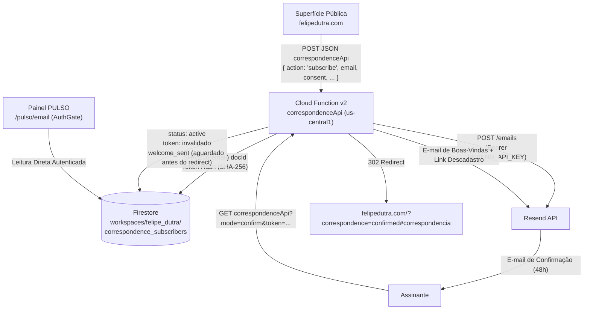

# PULSO // Correspondência · Setup, Operação & Arquitetura

Guia operacional da infraestrutura de correspondência de fe (`felipedutra.com`), cobrindo backend Cloud Functions v2 (`correspondenceApi`), painel interno na PULSO (`/pulso/email`), segurança de tokens, deploy, rollback e roadmap de extensão.

---

## 1. Arquitetura Canônica



### Contrato de Dados (Firestore)
- **Caminho**: `workspaces/felipe_dutra/correspondence_subscribers/{docId}`
- **ID do Documento**: SHA-256 do email normalizado (`normalizeEmail(email)`: trim, lowercase, remoção de caracteres invisíveis). **Nunca** o email cru.
- **Campos**:
  - `name`: `string | null` (sanitizado, tags HTML removidas, máx. 100 caracteres).
  - `email`: `string` (normalizado).
  - `source`: `string` (sanitizado, padrão `"web"`).
  - `status`: `"pending" | "active" | "unsubscribed" | "error"`.
  - `consentAt`: `Timestamp` (momento do opt-in explícito).
  - `createdAt`: `Timestamp`.
  - `updatedAt`: `Timestamp`.
  - `confirmedAt`: `Timestamp | null`.
  - `unsubscribedAt`: `Timestamp | null`.
  - `lastDeliveryStatus`: `"queued" | "confirmation_sent" | "welcome_sent" | "failed"`.
  - `lastDeliveryAt`: `Timestamp | null`.
  - `errorCode`: `string | null` (código de erro seguro, ex: `RESEND_API_ERROR`, `TOKEN_EXPIRED`, sem vazar stack trace ou dados sensíveis).
  - `confirmationTokenHash`: `string | null` (SHA-256 do token criptográfico de 256 bits). **Nunca** o token cru.
  - `confirmationExpiresAt`: `Timestamp | null` (48 horas a partir da emissão).
  - `unsubscribeTokenHash`: `string | null` (SHA-256 do token gerado para descadastro seguro).

---

## 2. Princípios de Segurança e Privacidade

1. **Prevenção de Enumeração**:
   - Qualquer submissão pública via `POST` recebe uma resposta genérica idêntica:
     `{ "status": "ok", "message": "Inscrição processada com sucesso..." }`
   - Se o assinante já estiver ativo, nenhuma alteração é feita e nenhum e-mail duplicado é disparado.
2. **Tokens Fortes e Uso Único**:
   - Gerados com `crypto.randomBytes(32)` (256 bits de entropia).
   - O token cru viaja exclusivamente no link do e-mail.
   - No Firestore é persistido apenas o hash `SHA-256(token)`.
   - Ao confirmar ou descadastrar, o token é invalidado imediatamente (`null`).
3. **Validade e Cooldown**:
   - O link de confirmação expira em 48 horas.
   - Cooldown de 120 segundos contra submissões repetidas de um mesmo e-mail, prevenindo flood e desperdício de cota no Resend.
4. **Honeypot Silencioso**:
   - O campo `honeypot` no payload descarta bots imediatamente retornando 200 OK sem tocar no banco ou na API de envio.
5. **CORS e Origin Rigorosos**:
   - `POST` exige header `Origin` autorizado (`https://felipedutra.com`, `https://www.felipedutra.com` e origens de desenvolvimento local como `http://localhost:*` e `http://127.0.0.1:*`).
   - Requisições `POST` sem `Origin` ou com origem não autorizada são sumariamente rejeitadas com 403.
   - Requisições `GET` de links (confirmação e descadastro clicados em clientes de e-mail) prosseguem sem exigência de `Origin`.
   - Preflight `OPTIONS` implementado com cache de 24h (`Max-Age: 86400`).
6. **Ofuscação de Logs**:
   - Nenhuma linha de log expõe e-mail cru ou tokens. Apenas os 8 primeiros caracteres do hash do documento são impressos (`docSnap.id.slice(0, 8)`).

---

## 3. Variáveis e Segredos (Sem Valores)

### Segredo Firebase (Cloud Secret Manager)
- `RESEND_API_KEY`: Chave da API do Resend. Definida via `defineSecret("RESEND_API_KEY")`.

Para configurar ou atualizar:
```bash
firebase functions:secrets:set RESEND_API_KEY
```

### Variáveis de Ambiente Opcionais (Cloud Functions)
- `CORRESPONDENCE_FROM_EMAIL`: Remetente padrão (default: `fe · correspondência <contato@felipedutra.com>`).
- `CORRESPONDENCE_REPLY_TO`: Endereço de resposta (default: `contato@felipedutra.com`).
- `CORRESPONDENCE_BASE_URL`: URL base para links (default direto: `https://us-central1-felipedutraapps.cloudfunctions.net/correspondenceApi`, já que felipedutra.com é site estático sem proxy).

---

## 4. Procedimento de Deploy

### Pré-requisitos
- Secret `RESEND_API_KEY` cadastrado no Cloud Secret Manager do projeto Firebase.
- Domínio `felipedutra.com` verificado no Resend com registros DKIM/SPF/DMARC válidos.

### Comandos de Deploy
```bash
# 1. Build e validação local das funções
cd functions
npm run build
npm test

# 2. Build da aplicação Next.js
cd ..
npm run build

# 3. Deploy da função e do Hosting (rewrites)
firebase deploy --only functions:correspondenceApi,hosting
```

---

## 5. Procedimento de Rollback

Caso seja necessária a reversão imediata:

```bash
# 1. Reverter commit no Git
git revert <commit-hash>

# 2. Re-deploy da versão estável anterior das funções
cd functions && npm run build
firebase deploy --only functions:correspondenceApi,hosting

# 3. Se necessário desabilitar tráfego na Cloud Function imediatamente pelo GCP Console:
# Cloud Functions > correspondenceApi > Gerenciar Tráfego / Reverter Revisão
```

---

## 6. Painel Interno PULSO (`/pulso/email`)

- **Acesso**: Restrito aos usuários autenticados via Google no workspace `felipe_dutra` (garantido por `AuthGate` e `firestore.rules`).
- **Navegação**: Item `E-mail` no menu lateral e superior, com ícone `Mail`.
- **Métricas Vivas**: Indicadores visuais etéreos sem molduras ou cards rígidos:
  - Total de registros
  - Presenças ativas
  - Aguardando eco (pendentes)
  - Anomalias (falhas de entrega com códigos seguros)
  - Dissipados (descadastros)
- **Busca e Filtros**: Busca local instantânea por nome, e-mail e origem; filtros por estado com estética ritualística e sem cápsulas/pills genéricas.
- **Segurança da UI**: Tokens de confirmação e descadastro **nunca** são expostos na interface.

---

## 7. Roadmap: Extensão Futura para Campanhas em Massa

Esta versão implementa com rigor o fluxo unitário (inscrição, confirmação 1:1, autoresposta de boas-vindas e descadastro).
Para envio de correspondências / newsletters completas no futuro:

1. **Batching e Filas de Disparo**:
   - Integração com Cloud Tasks ou Pub/Sub para processar envios em lotes de 100 assinantes por segundo, respeitando limites de taxa da Resend Batch API (`POST /emails/batch`).
2. **Webhooks do Resend**:
   - Endpoint autenticado para receber eventos `email.bounced`, `email.complained` e `email.delivered`.
   - Atualização automática do status do assinante para `error` ou `unsubscribed` em caso de hard bounce.
3. **Segmentação e Campanhas**:
   - Subcoleção `workspaces/felipe_dutra/correspondence_campaigns` para registrar rascunhos, histórico de envios e métricas de abertura.
4. **Headers RFC 8058 (One-Click Unsubscribe)**:
   - Adição dos headers `List-Unsubscribe` e `List-Unsubscribe-Post` nas campanhas em massa para conformidade com Gmail e Yahoo.
