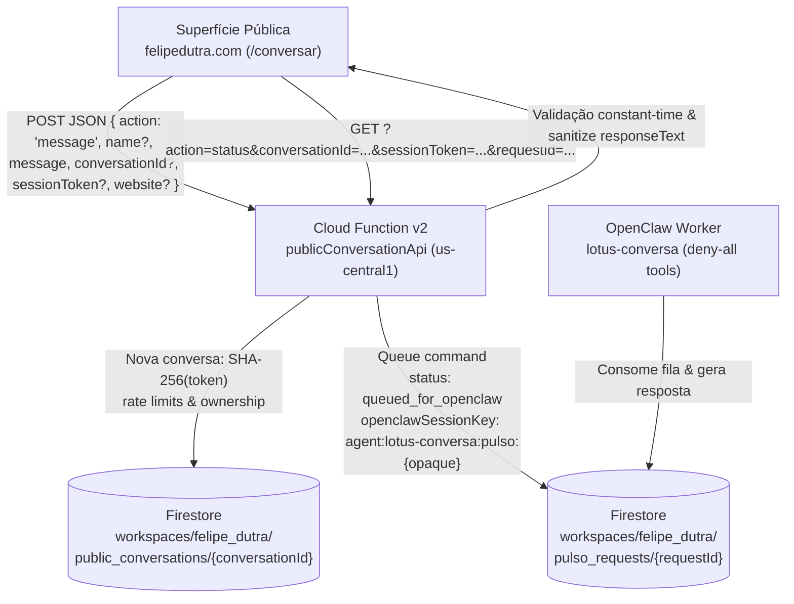

# PULSO // Bridge Público de Conversa · Setup, Operação & Arquitetura

Guia operacional e de arquitetura da função HTTPS Cloud Functions v2 `publicConversationApi`, responsável por conectar visitantes de `felipedutra.com` ao agente cognitivo isolado `lotus-conversa` (OpenClaw) por meio do contrato de fila em `workspaces/felipe_dutra/pulso_requests`.

---

## 1. Arquitetura Canônica



### Contrato de Dados (Firestore)

#### 1. Conversas Públicas (`workspaces/felipe_dutra/public_conversations/{conversationId}`)
- **ID do Documento**: UUID v4 criptográfico (`crypto.randomUUID()`).
- **Campos**:
  - `conversationId`: `string` (UUID).
  - `tokenHash`: `string` (Hash SHA-256 do token de sessão de 32 bytes/64 caracteres hex). **Nunca o token em texto puro**.
  - `createdAt`: `Timestamp`.
  - `updatedAt`: `Timestamp`.
  - `lastMessageAt`: `Timestamp` (usado para cooldown mínimo de 5 segundos).
  - `messageCountHour`: `number` (contador de mensagens na janela horária atual, máx. 20/hora).
  - `hourWindowStart`: `Timestamp` (início da janela horária móvel de 1 hora).
  - `totalMessages`: `number` (total acumulado).
  - `status`: `"active" | "blocked"`.
  - `latestRequestId`: `string` (referência ao último `requestId`).
  - `visitorName`: `string | null` (nome de exibição opcional sanitizado, máx. 80 caracteres).
- **Subcoleção de Propriedade**: `requests/{requestId}`
  - `requestId`: `string`.
  - `conversationId`: `string`.
  - `createdAt`: `Timestamp`.
  - `status`: `string`.

#### 2. Requisições OpenClaw (`workspaces/felipe_dutra/pulso_requests/{requestId}`)
- **Campos gravados pelo Bridge**:
  - `id`: `requestId` (`req_{timestamp}_{random}`).
  - `requestType`: `"conversation_command"`.
  - `status`: `"queued_for_openclaw"`.
  - `source`: `"fe_site_public"`.
  - `mode`: `"text"`.
  - `input` / `rawInput`: mensagem de texto normalizada (máx. 2000 caracteres).
  - `contextId`: `"public_site_" + opaqueKey`.
  - `chatId`: `conversationId`.
  - `conversationId`: `conversationId`.
  - `context`: `{ userName, locale: 'pt-BR', timezone: 'America/Sao_Paulo', interface: 'website_public', currentRoute: '/conversar', publicSurface: true }`.
  - `openclawSessionKey`: `"agent:lotus-conversa:pulso:" + opaqueKey`.
  - `runtimeSessionKey`: `"agent:lotus-conversa:pulso:" + opaqueKey`.
  - `handoff`: `{ target: "openclaw", mode: "proposal_only" }`.
  - `priority`: `"medium"`.
  - `archived`: `false`.
  - `publicSurface`: `true`.

---

## 2. Princípios de Segurança e Privacidade

As sessões desta superfície pública são registradas diretamente como `ready`
com a chave fixa do agente isolado `lotus-conversa`. Isso evita que a primeira
resposta dependa da fila genérica de aquecimento da PULSO; a execução continua
passando pelo worker canônico e pelo mesmo perímetro fechado do agente público.

1. **Zero Coleta de PII Involuntária**:
   - Nenhum e-mail ou identificador de dispositivo é solicitado ou armazenado.
   - O campo `name` é estritamente opcional (máx. 80 caracteres, tags HTML e caracteres de controle removidos).
2. **Tokens Fortes e Verificação em Tempo Constante**:
   - `sessionToken` gerado via `crypto.randomBytes(32)` (256 bits).
   - O token cru é retornado **apenas uma vez** na criação da conversa.
   - O Firestore armazena apenas `SHA-256(sessionToken)`.
   - Verificações de sessão subsequentes utilizam `crypto.timingSafeEqual` para prevenir ataques de temporização (timing attacks).
3. **CORS Estrito e Headers de Proteção**:
   - Origem permitida estritamente restrita a `https://felipedutra.com` (e `localhost`/`127.0.0.1` para testes de desenvolvimento).
   - Demais origens recebem `403 Forbidden`.
   - Headers: `Cache-Control: no-store, no-cache, must-revalidate`, `X-Content-Type-Options: nosniff`, `X-Frame-Options: DENY`, `Content-Security-Policy: default-src 'none'`.
4. **Honeypot Silencioso**:
   - Campo `website` no payload JSON. Se preenchido por robôs, a API responde `200 OK` com payload simulado (`status: "queued"`), sem persistir dados no Firestore nem onerar o worker cognitivo.
5. **Rate Limiting Transacional**:
   - Cooldown entre mensagens: 5 segundos.
   - Teto por conversa: máximo de 20 mensagens por hora.
   - Avaliado e incrementado dentro de transação atômica do Firestore.
   - Respostas de erro nunca expõem caminhos internos ou metadados de infraestrutura.
6. **Agente Lótus Isolado (`lotus-conversa`)**:
   - `openclawSessionKey: agent:lotus-conversa:pulso:{opaque}` conecta-se ao agente com ferramentas desabilitadas (`deny-all tools`) e workspace restrito à superfície pública, sem acesso a dados operacionais internos.

---

## 3. Especificação da API

### POST `/publicConversationApi`
Inicia uma conversa ou envia uma nova mensagem.

#### Payload JSON:
```json
{
  "action": "message",
  "name": "Visitante",
  "message": "Olá! Gostaria de conversar.",
  "conversationId": "e5b87190-64d8-4f81-80a5-2dcfa2ea6895",
  "sessionToken": "64_hex_token_aqui",
  "website": ""
}
```

#### Respostas:
- **Nova conversa (`200 OK`)**:
  ```json
  {
    "status": "queued",
    "conversationId": "e5b87190-64d8-4f81-80a5-2dcfa2ea6895",
    "sessionToken": "a1b2c3...64chars",
    "requestId": "req_1774734000000_abcd1234"
  }
  ```
- **Conversa existente (`200 OK`)**:
  ```json
  {
    "status": "queued",
    "conversationId": "e5b87190-64d8-4f81-80a5-2dcfa2ea6895",
    "requestId": "req_1774734010000_ef012345"
  }
  ```
- **Erros**:
  - `400 Bad Request`: mensagem vazia, excede 2000 chars ou payload malformado.
  - `401 Unauthorized`: token ausente em conversa existente.
  - `403 Forbidden`: origem não autorizada ou token inválido.
  - `429 Too Many Requests`: cooldown ativo ou teto horário atingido.

---

### GET `/publicConversationApi`
Consulta o status de uma mensagem enviada.

#### Parâmetros de Query:
`?action=status&conversationId={id}&sessionToken={token}&requestId={requestId}`

#### Respostas:
- **Em processamento**:
  ```json
  { "status": "queued" }
  ```
  ou
  ```json
  { "status": "running" }
  ```
- **Concluído**:
  ```json
  {
    "status": "success",
    "responseText": "Olá! Seja bem-vindo ao espaço de diálogo de fe."
  }
  ```
- **Falha**:
  ```json
  { "status": "error" }
  ```

---

## 4. Guia de Deploy

### Pré-requisitos
Antes de publicar, execute as validações locais no diretório `functions/`:

```bash
cd functions
npm test
npm run build
```

Ambos os comandos devem sair com código 0 (sucesso absoluto).

### Comando de Publicação
Para publicar exclusivamente a função `publicConversationApi` sem interferir nas demais funções de produção:

```bash
firebase deploy --only functions:publicConversationApi
```

---

## 5. Guia de Rollback

Caso seja necessário reverter ou desativar o endpoint imediatamente:

### Opção 1: Remoção Imediata da Cloud Function
Para desativar o endpoint público sem afetar dados no Firestore:

```bash
firebase functions:delete publicConversationApi --region us-central1 --force
```

### Opção 2: Reversão de Código
Reverta o commit específico no Git e reimplante:

```bash
git revert <commit-hash>
cd functions && npm run build
firebase deploy --only functions:publicConversationApi
```

---

## 6. Testes Manuais de Fumaça (Smoke Tests)

```bash
# 1. Nova conversa (Origin localhost de teste)
curl -X POST https://us-central1-felipedutraapps.cloudfunctions.net/publicConversationApi \
  -H "Origin: http://localhost:3000" \
  -H "Content-Type: application/json" \
  -d '{"action":"message","name":"Teste","message":"Olá teste"}'

# 2. Consulta de status
curl "https://us-central1-felipedutraapps.cloudfunctions.net/publicConversationApi?action=status&conversationId=<CONV_ID>&sessionToken=<TOKEN>&requestId=<REQ_ID>" \
  -H "Origin: http://localhost:3000"

# 3. Teste de Honeypot (deve responder 200 silent success)
curl -X POST https://us-central1-felipedutraapps.cloudfunctions.net/publicConversationApi \
  -H "Origin: http://localhost:3000" \
  -H "Content-Type: application/json" \
  -d '{"action":"message","message":"Spam bot","website":"https://bot.spam"}'
```
